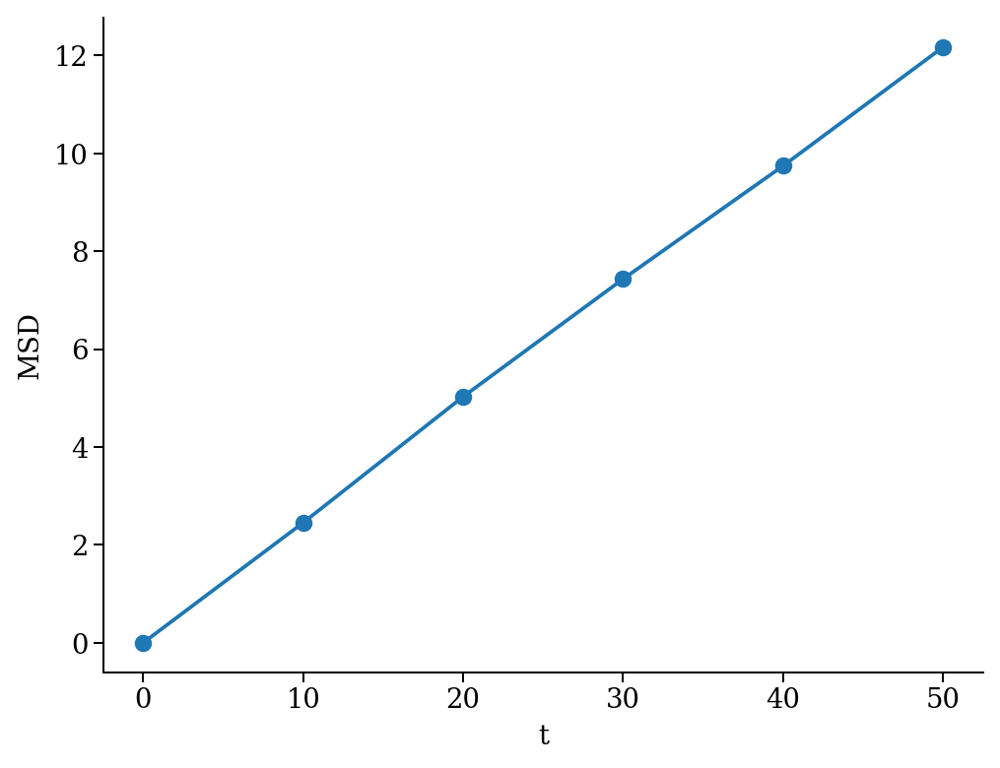
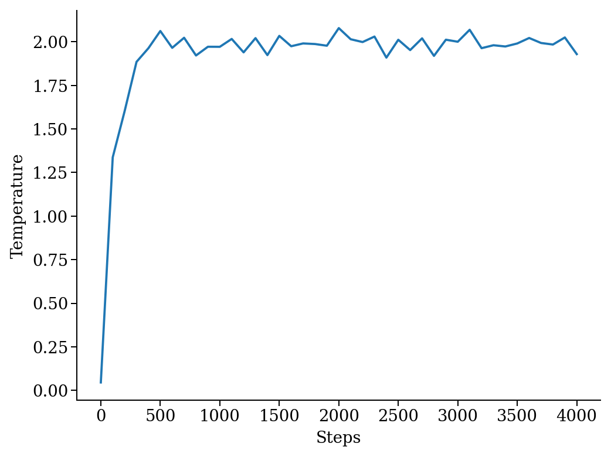

Simulations
-----------

The atooms' interface abstracts out most of the common tasks of particle-based simulations. The actual simulation is performed by a simulation "backend", which exposes a minimal but consistent interface. This enables one to develop complex simulation frameworks (e.g., `parallel tempering <https://framagit.org/atooms/parallel_tempering>`_) that are essentially decoupled from the underlying simulation code.

A **Simulation** is a high-level class that encapsulates some common tasks, like regularly storing data on files, and provides a consistent interface to the user, while **backend** classes actually make the system evolve. Here, we implement a minimal backend to run a simulation.

At a very minimum, a backend is a class that provides 

- a **system** instance variable, which should (mostly) behave like ``atooms.system.System``

- a **run()** method, which evolves the system for a prescribed number of steps (passed as argument)

Optionally, the backend may hold a reference to a trajectory class, which can be used to checkpoint the simulation or to write configurations to a file. This is however not required in a first stage.

A minimal simulation backend
~~~~~~~~~~~~~~~~~~~~~~~~~~~~

We set up a bare-bones simulation backend building on the native System class

.. code:: python

    from atooms.system import System

    class BareBonesBackend(object):
    
        def __init__(self):
            self.system = System()

        def run(self, steps):
            for i in range(steps):
                pass

    # The backend is created and wrapped by a simulation object.
    # Here we first call the run() method then run_until()
    from atooms.simulation import Simulation
    backend = BareBonesBackend()
    simulation = Simulation(backend)
    simulation.run(10)
    simulation.run_until(30)
    assert simulation.current_step == 30

    # This time we call run() multiple times 
    simulation = Simulation(backend)
    simulation.run(10)
    simulation.run(20)
    assert simulation.current_step == 30  

    # Increase verbosity to see a meaningful log
    from atooms.core.utils import setup_logging
    setup_logging(level=20)
    simulation = Simulation(backend)
    simulation.run(10)  

::

    # 
    # atooms simulation via <__main__.BareBonesBackend object at 0x7f00e6d21250>
    # 
    # version: 3.14.1+3.13.1-dirty (tag Tagger: 3.13.1 2022-12-08)
    # atooms version: 3.14.1+3.13.1-dirty (tag Tagger: 3.13.1 2022-12-08)
    # simulation started on: 2022-12-09 at 20:39
    # output path: None
    # backend: <class '__main__.BareBonesBackend'>
    # 
    # target target_steps: 10
    # 
    # 
    # <__main__.BareBonesBackend object at 0x7f00e6d21250>
    # simulation ended successfully: reached target steps 10
    # 
    # final steps: 10
    # final rmsd: 0.00
    # wall time [s]: 0.00
    # average TSP [s/step/particle]: nan
    # simulation ended on: 2022-12-09 at 20:39

Simple random walk
~~~~~~~~~~~~~~~~~~

We implement a simple random walk in 3d. This requires adding code to the backend ``run()`` method to actually move the particles around. The code won't be very fast! See below `Faster backends`_.

We start by building an empty system. Then we add a few particles and place them at random in a cube. Finally, we write a backend that displaces each particle randomly over a cube of prescribed side.

.. code:: python

    import numpy
    from random import random
    from atooms.system import System
    from atooms.system.particle import Particle

    system = System()
    L = 10
    for i in range(1000):
        p = Particle(position=[L * random(), L * random(), L * random()])
        system.particle.append(p)

    class RandomWalk(object):

        def __init__(self, system, delta=1.0):
            self.system = system
            self.delta = delta

        def run(self, steps):
            for i in range(steps):
                for p in self.system.particle:
                    dr = numpy.array([random()-0.5, random()-0.5, random()-0.5])
                    dr *= self.delta
                    p.position += dr

Adding callbacks
~~~~~~~~~~~~~~~~

The Simulation class allows you to execute of arbitrary code during the simulation via "callbacks". They can be used for instance to

- store simulation data

- write logs or particle configurations to trajectory files

- perform on-the-fly calculations of the system properties

- define custom conditions to stop the simulation

Callbacks are plain function that accept the simulation object as first argument. They are called at prescribed intervals during the simulation.

As an example, we measure the mean square displacement (MSD) of the particles to make sure that the system displays a regular diffusive behavior :math:`MSD \sim t`

.. code:: python

    from atooms.simulation import Simulation
    simulation = Simulation(RandomWalk(system))

    # We add a callback that computes the MSD every 10 steps
    # We store the result in a dictionary passed to the callback
    msd_db = {}
    def cbk(sim, initial_position, db):
        msd = 0.0
        for i, p in enumerate(sim.system.particle):
            dr = p.position - initial_position[i]
            msd += numpy.sum(dr**2)
        msd /= len(sim.system.particle)
        db[sim.current_step] = msd

    # We will execute the callback every 10 steps
    simulation.add(cbk, 10, initial_position=[p.position.copy() for p in
                                              system.particle], db=msd_db)
    simulation.run(50)

    # The MSD should increase linearly with time
    time = sorted(msd_db.keys())
    msd = [msd_db[t] for t in time]

    import matplotlib.pyplot as plt
    plt.cla()
    plt.plot(time, msd, '-o')
    plt.xlabel("t")
    plt.ylabel("MSD")
    plt.savefig('msd.png', bbox_inches='tight')

The MSD as a function of time should look linear.

The `postprocessing <https://gitlab.info-ufr.univ-montp2.fr/atooms/postprocessing/>`_ component package provides way more options to compute dynamic correlation functions.

Fine-tuning the scheduler
~~~~~~~~~~~~~~~~~~~~~~~~~

Calling a callback can be done at regular intervals during the simulation or according to a custom schedule defined by a ``Scheduler``. Here we consider the ``simulation.write_trajectory()`` callback, which writes the system state in a trajectory file

.. code:: python

    from atooms.trajectory import TrajectoryXYZ
    from atooms.simulation import write_trajectory

    simulation = Simulation(RandomWalk(system))
    trajectory = TrajectoryXYZ('/tmp/trajectory.xyz', 'w')
    # Write every 10 steps
    simulation.add(write_trajectory, Scheduler(10), trajectory=trajectory)

Here are a few options of the Scheduler:

- ``interval``: notify at a fixed steps interval (default)

- ``calls``: fixed number of calls to the callback

- ``steps``: list of steps at which the callback will be called

- ``block``: as steps, but the callback will be called periodically

- ``seconds``: notify every ``seconds``

One useful application of the Scheduler is writing frames in a trajectory at exponentialy spaced intervals. Here the

.. code:: python

    trajectory_exp = TrajectoryXYZ('/tmp/trajectory_exp.xyz', 'w')
    simulation.add(write_trajectory, Scheduler(block=[0, 1, 2, 4, 8, 16]), trajectory=trajectory_exp)
    simulation.run(32)
    trajectory.close()
    trajectory_exp.close()

Now we will have two trajectories, one with regular and the other with exponentially spaced blocks of frames

.. code:: python

    with TrajectoryXYZ('/tmp/trajectory.xyz') as th, \
         TrajectoryXYZ('/tmp/trajectory_exp.xyz') as th_exp:
        print('Regular:', th.steps)
        print('Exponential:', th_exp.steps)

::

    Regular: [0, 10, 20, 30]
    Exponential: [0, 1, 2, 4, 8, 16, 17, 18, 20, 24, 32]

Compute statistical averages
~~~~~~~~~~~~~~~~~~~~~~~~~~~~

The ``simulation.store()`` callback allows you to store data in a dictionary while the simulation is running. Here are a few ways to use it to perform some statistical analysis.

The ``store`` callback accepts an array of arguments to store. They can be string matching a few predefined attributes (such as ``steps``, the current number of steps carried out by the backend) or a general attribute of the ``simulation`` instance (such as ``system.particle[0].position[0]``, the x-coordinate of the first particle of the system).

.. code:: python

    import numpy
    from atooms.simulation import store

    simulation = Simulation(RandomWalk(system))
    simulation.add(store, 1, ['steps', 'system.particle[0].position[0]'])

By default, after running the simulation, the data will be stored in the ``simulation.data`` dictionary and you can use it for further analysis

.. code:: python

    import numpy
    simulation.run(10)
    print(numpy.mean(simulation.data['system.particle[0].position[0]']))

::

    -9.112113813995027

You can store the result of any function that takes as first argument the simulation instance. Just add a tuple with a label and the function to the list of properties to store.

.. code:: python

    simulation = Simulation(RandomWalk(system))
    simulation.add(store, 1, ['steps', ('x_1', lambda sim: sim.system.particle[1].position[0])])
    simulation.run(10)

Faster backends
~~~~~~~~~~~~~~~

Moving particles using the ``Particle`` object interface is expressive but computationally very slow, since it forces us to operate one particle at a time. We can write a more efficient backend by getting a "view" of the system's coordinates as a numpy array and operating on it vectorially. You can also pass the viewed arrays to backends written in compiled languages (even just in time).

.. code:: python

    import numpy
    from atooms.system import System

    # Create a system with 10 particles
    system = System(N=10)

    class FastRandomWalk(object):

        def __init__(self, system, delta=1.0):
            self.system = system
            self.delta = delta

        def run(self, steps):
            # Get a view on the particles' position
            pos = self.system.view("position")
            for i in range(steps):
                dr = (numpy.random(pos.shape) - 0.5) * self.delta
                # Operate on array in-place
                pos += dr

.. note::

    Here is the recommended approach:

    - get a view of the arrays you need **once** at the beginning of ``run()``

    - if possible, operate on those arrays **in-place**

    - if you make copies of the arrays, update the viewed arrays at the end of ``run()``

    This way the attributes of the ``Particle`` objects will remain in sync with viewed arrays

The viewed array can be cast in C-order (default) or F-order using the ``order`` parameter

.. code:: python

    system.view("position", order='C')
    system.view("position", order='F')

If :math:`N` is the number of particles and :math:`d` is the number of spatial dimensions, then you'll get

- $(N, d)$-dimensional arrays with ``order``'C'= (default)

- $(d, N)$-dimensional arrays with ``order``'F'=

Of course, this option is relevant only for vector attributes like positions and velocities.

You can get a view of any system property by providing a "fully qualified" attribute

.. code:: python

    assert system.view("cell.side") == system.cell.side

In particular, for particles' attributes you can use this syntax

.. code:: python

    assert numpy.all(system.view("particle.position") == system.view("pos"))

Molecular dynamics with LAMMPS
~~~~~~~~~~~~~~~~~~~~~~~~~~~~~~

Atooms provides a simulation backend for ``LAMMPS``, an efficient and feature-rich molecular dynamics simulation package.
The backend accepts a string variable containing regular LAMMPS commands and initial configuration to start the simulation. The latter can be provided in any of the following forms:

- a ``System`` object

- a ``Trajectory`` object

- the path to an xyz trajectory

In the last two cases, the last configuration will be used to start the simulation. 

Here we we use the first configuration of an existing trajectory for a Lennard-Jones fluid

.. code:: python

    import os
    import atooms.trajectory as trj
    from atooms.backends import lammps

    # You can change it so that it points to the LAMMPS executable
    lammps.lammps_command = 'lmp'

    system = trj.TrajectoryXYZ('data/lj_N1000_rho1.0.xyz')[0]
    cmd = """
    pair_style      lj/cut 2.5
    pair_coeff      1 1 1.0 1.0  2.5
    neighbor        0.3 bin
    neigh_modify    check yes
    timestep        0.002
    """
    backend = LAMMPS(system, cmd)

We now wrap the backend in a simulation instance. This way we can rely on atooms to write thermodynamic data and configurations to disk during the simulation: we just add the ``write_config()`` and ``write_thermo()`` callbacks to the simulation.
You can add your own functions as callbacks to perform arbitrary manipulations on the system during the simulation. Keep in mind that calling these functions causes some overhead, so avoid calling them at too short intervals.

.. code:: python

    from atooms.simulation import Simulation
    from atooms.system import Thermostat
    from atooms.simulation.observers import write_thermo, write_config

    # We create the simulation instance and set the output path
    sim = Simulation(backend, output_path='/tmp/lammps.xyz')
    # Just store a reference to the trajectory class you want to use
    sim.trajectory_class = trj.TrajectoryXYZ
    # Write configurations every 500 steps in xyz format
    sim.add(write_config, 500)
    # Store thermodynamic properties every 10 steps
    sim.add(store, 100, ['steps', 'potential energy per particle', 'temperature'])

We add a thermostat to keep the system temperature at T=2.0 and run the simulations for 10000 steps.

.. code:: python

    backend.system.thermostat = Thermostat(temperature=2.0, relaxation_time=0.1)
    sim.run(10000)

Note that we use atooms ``Thermostat`` object here: the backend will take care of adding appropriate commands to the LAMMPS script.

We have a quick look at the kinetic temperature as function of time to make sure the thermostat is working

.. code:: python

    import matplotlib.pyplot as plt
    plt.plot(sim.data['steps'], sim.data['temperature'])
    plt.xlabel('Steps')
    plt.ylabel('Temperature')
    plt.savefig('lammps.png', bbox_inches='tight')
    plt.show()

We can then use the `postprocessing <https://gitlab.info-ufr.univ-montp2.fr/atooms/postprocessing/>`_ package to compute the radial distribution function or any other correlation function from the trajectory.

Molecular dynamics with RUMD
~~~~~~~~~~~~~~~~~~~~~~~~~~~~

There is native support for an efficient MD molecular dynamics code running entirely on GPU called `RUMD <https://rumd.org>`_, developed by the Glass and Time group in Roskilde. It is optimized for small and medium-size systems.

Here we pick the last frame of the trajectory, change the density of the system to unity and write this new configuration to a trajectory format suitable for RUMD

.. code:: python

    with Trajectory('input.xyz') as trajectory:
        system = trajectory[-1]
        system.density = 1.0
        print('New density:', len(system.particle) / system.cell.volume)

    from atooms.trajectory import TrajectoryRUMD
    with TrajectoryRUMD('rescaled.xyz.gz', 'w') as trajectory:
        trajectory.write(system)

Now we run a short molecular dynamics simulation with the ``RUMD`` backend, using a Lennard-Jones potential:

.. code:: python

    import rumd
    from atooms.backends.rumd import RUMD
    from atooms.simulation import Simulation

    potential = rumd.Pot_LJ_12_6(cutoff_method=rumd.ShiftedPotential)
    potential.SetParams(i=0, j=0, Epsilon=1.0, Sigma=1.0, Rcut=2.5)
    backend = RUMD('rescaled.xyz.gz', [potential], integrator='nve'
    sim = Simulation(backend)
    sim.run(1000)
    print('Final temperature and density:', sim.system.temperature, sim.system.density)

A repository of interaction models for simple liquids and glasses is available in the `atooms-models <https://framagit.org/atooms/models>`_ component package. It generates RUMD potentials automatically from standardized json file or Python dictionaries.

Energy minimization with LAMMPS
~~~~~~~~~~~~~~~~~~~~~~~~~~~~~~~

It is possible to minimize the energy of a system to determine its so-called inherent structure using LAMMPS as a backend. To achieve this, atooms defines an ``Optimization`` class, which behaves mostly as ``Simulation`` except that it stops when the mean square total force

.. math::

    W=\frac{1}{N}\sum_i |f_i|^2

is lower than a given ``tolerance``.

.. code:: python

    from atooms.trajectory import TrajectoryXYZ
    from atooms.optimization import Optimization
    from atooms.backends.lammps import EnergyMinimization
    cmd = """
    pair_style      lj/cut 2.5
    pair_modify     shift yes
    pair_coeff      1 1 1.0 1.0 2.5
    """
    system = TrajectoryXYZ('../../data/lj_N256_rho1.0.xyz')[0]
    bck = EnergyMinimization(system, cmd)
    opt = Optimization(bck, tolerance=1e-10)
    opt.run()

We check that :math:`W` is lower than the requested tolerance

.. code:: python

    e_final = system.potential_energy(per_particle=True)
    w_final = system.force_norm_square(per_particle=True)
    print('Energy={}, mean square force={:.2g}'.format(e_final, w_final))

::

    Energy=-6.8030584, mean square force=3.6e-11

We will find more optimization algorithms (such as FIRE, l-BFGS, eigenvector-following, ...) in `atooms-landscape <https://framagit.org/atooms/landscape>`_ component package.
